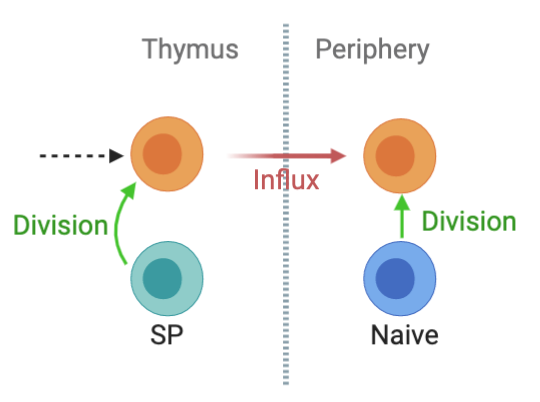

### .center[Variation in Naive T cell pool size]
<hr>

- Counts of $\small \text{CD}44^{low} \;\; \text{CD62L}^{high}$ cells isolated from pooled lymph nodes.

</br>

```{r echo=FALSE, fig.retina=3}

knitr::include_graphics("figures/counts_data.png")
```

---

### .center[Measuring cell division in T lymphocytes]
<hr>

- $\small \text{Ki}67$ — a nuclear protein expressed during cell-division.

</br>
```{r echo=FALSE, fig.retina=3}

knitr::include_graphics("figures/ki_data.png")
```
---
class: inverse
background-image: url("figures/inverse_bg.png")

<hr>
.pull-left[
```{r echo=FALSE, fig.retina=3, out.width='300', fig.asp='1'}


```
]
.pull-right[
</br>
- T cells express Ki67 protein for ~ 4 days after the division.
.right[Hogan _et. al._, PNAS 2015]
]
- Hard to untangle the origin of Ki67 expression within peripheral naive T cells.
**Thymic Inheritance or division in periphery?**

</br>
<hr>
--


### Mathematical models
- can track the division history of naive T cells and quantify the contributions to Ki67 expression from _thymic influx_ and _peripheral division._

--

- can dissect the heterogeneity in **'homeostatic fitness'** amongst naive T cells.

---

###  .center[Potential mechanisms of naive T cell maintenance]
<hr>


```{r echo=FALSE, fig.retina=3, out.width='700', out.height='470'}


```


---
class: center
### .left[Homogeneous Models]
<hr>

```{r echo=FALSE, fig.retina=3, out.width='420'}

knitr::include_graphics("figures/neutral_diag.png")
```

.left[
$$
\small
\begin{aligned}
&N(t) = N^+(t) + N^-(t); \quad
&\kappa(t) = \frac{N^+(t)}{N(t)}
\end{aligned}
$$
]

--

</br>

.shadedbox[
$$
\begin{aligned}
&\dot N^+ = \alpha \, \theta^+(t) + \rho(N) \, (2\,N^- + N^+) - (\beta + \delta(N)) \, N^+ \\
&\dot N^- = \alpha \, \theta^-(t) + \beta N^+ + \delta(N)) \, N^-
\end{aligned}
$$
]


???


---
### Model vaildation and comparison
<hr>

- Each model was fitted simultaneously to the timecourses of $\small log(\text{counts})$   proportions of $\small logit(\text{Ki}67^{high})$ cells.

$$
\text{Joint Likelihood} \Rightarrow \quad  p(y | \hat \theta) = \prod_{i=1}^n \, \text{Normal}(y_i - \text{model}(\theta)_i^\text{pred}, \, \sigma) 
$$

???
Each model was fitted simultaneously to the timecourses of $\small log(\text{counts})$   proportions of $\small logit(\text{Ki}67^{high})$ cells.

We form a joint likelihood which is the probability density of data across the parameter distribution $\theta$ by assuming that the errors are normally distributed. 

--

$$
\text{Bayesian approach}\Rightarrow \quad 
p(\hat \theta | y) = \frac{p(y | \hat \theta) \times p(\theta_\text{prior})} {p(y)}
$$

<hr>
???
- This probability density is then used to update our prior beliefs in model parameters using the bayesian approach.


We judge the models under consideration based on **parsimony** and their ability to predict **New observations** which is also called as out of sample prediction error.

--

</br>

.shadedbox2[
Occam's razor:
Models are selected based on **parsimony** and their ability to predict **New observations** &mdash; (out-of-sample prediction error).
]


---

<hr>
### Mesuring out-of-sample prediction error using Leave-One-Out cross validation.

```{r echo=FALSE, fig.retina=3, out.width="40%"}

knitr::include_graphics("figures/looic.png")
```


$$
\text{Leave-One-Out information criterion:} \,\,
\small \text{LooIC} = -2 \,\, \sum_{i=1}^n \, Z_i
$$

<hr>

???
We measure this  out of sample prediction error using Leave-One-Out cross validation, in which a single observation is treated as test dataset and rest of the observations are trated as training data. The process is repeated for all 'n' observations and the prediction error for each left-out test set is aggregated to calculate Leave-One-Out information criterion (LOOIC).


--

- Relative support: Akaike weight
.shadedbox[
$$
\omega_i = \frac{exp(-\frac{1}{2} \, [\text{LooIC}]_i)}{\sum_m^M  \, exp(-\frac{1}{2} \, [\text{LooIC}]_m)}
$$
]

???
We then used the estimated LOO-IC values to assess the relative support for models using the analog of the Akaike weight which gives us the probability that a given model will explain new data better than other models considered in this analysis.
\

