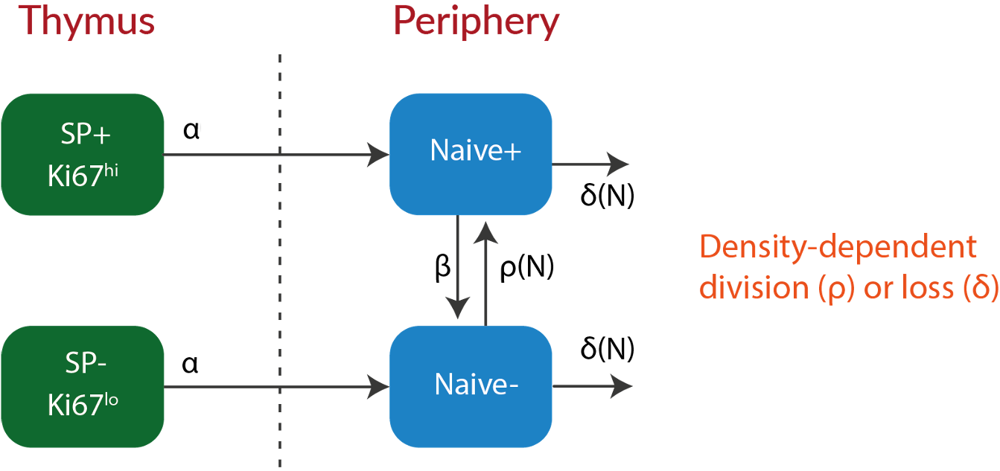
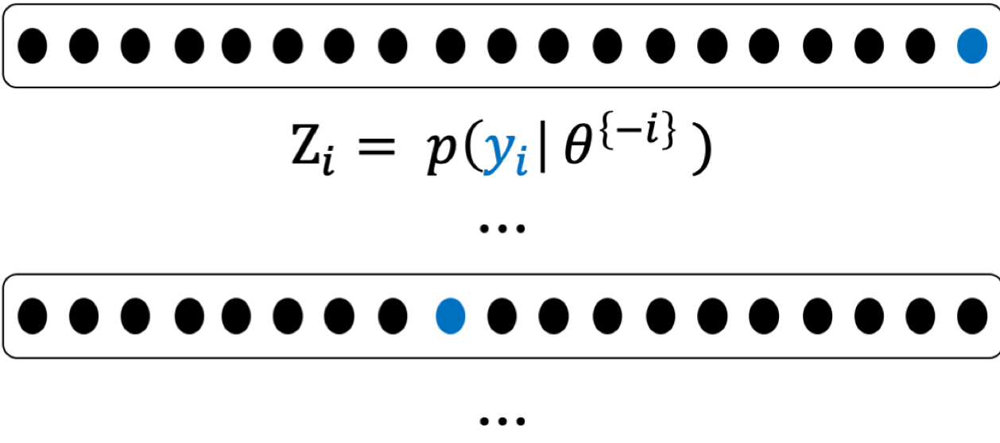
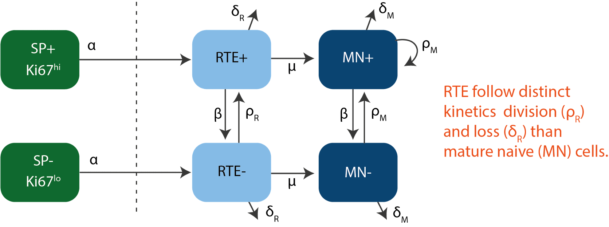
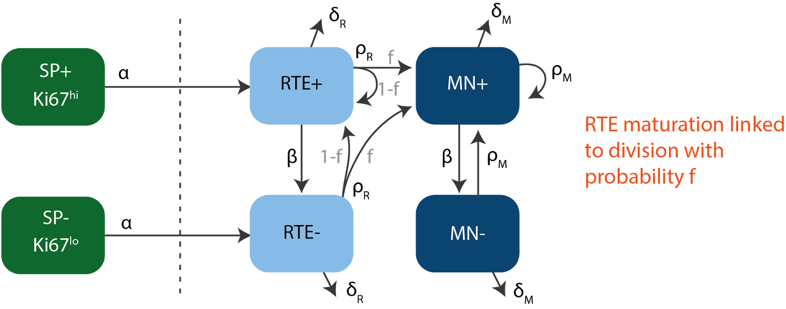
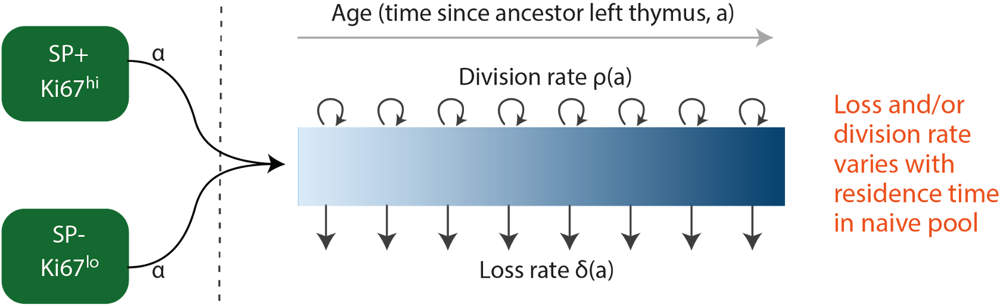

### .center[Variation in Naive T cell pool size]
<hr>

- Counts of $\small \text{CD}44^{low} \;\; \text{CD62L}^{high}$ cells isolated from pooled lymph nodes.

</br>

```{r echo=FALSE, fig.retina=3}

knitr::include_graphics("figures/counts_data.png")
```

---

### .center[Measuring cell division in T lymphocytes]
<hr>

- $\small \text{Ki}67$ — a nuclear protein expressed during cell-division.

</br>
```{r echo=FALSE, fig.retina=3}

knitr::include_graphics("figures/ki_data.png")
```
---
class: inverse
background-image: url("figures/inverse_bg.png")

<hr>
.pull-left[
```{r echo=FALSE, fig.retina=3, out.width='300', fig.asp='1'}

knitr::include_graphics("figures/ki67_untangle.png")
```
]
.pull-right[
</br>
- T cells express Ki67 protein for ~ 4 days after the division.
.right[Hogan _et. al._, PNAS 2015]
]
- Hard to untangle the origin of Ki67 expression within peripheral naive T cells.
**Thymic Inheritance or division in periphery?**

</br>
<hr>
--


### Mathematical models
- can track the division history of naive T cells and quantify the contributions to Ki67 expression from _thymic influx_ and _peripheral division._

--

- can dissect the heterogeneity in **'homeostatic fitness'** amongst naive T cells.

---

###  .center[Potential mechanisms of naive T cell maintenance]
<hr>


```{r echo=FALSE, fig.retina=3, out.width='700', out.height='470'}

knitr::include_graphics("figures/model_concepts.png")
```


---
class: center
### .left[Homogeneous Models]
<hr>

```{r echo=FALSE, fig.retina=3, out.width='420'}


```

.left[
$$
\small
\begin{aligned}
&N(t) = N^+(t) + N^-(t); \quad
&\kappa(t) = \frac{N^+(t)}{N(t)}
\end{aligned}
$$
]

--

</br>

.shadedbox[
$$
\begin{aligned}
&\dot N^+ = \alpha \, \theta^+(t) + \rho(N) \, (2\,N^- + N^+) - (\beta + \delta(N)) \, N^+ \\
&\dot N^- = \alpha \, \theta^-(t) + \beta N^+ + \delta(N)) \, N^-
\end{aligned}
$$
]


???
$\alpha$ - rate of daily influx into the naive pool

$\rho$ - rate of cell division

$\delta$ - rate of loss by death and differentiation

$beta$ - rate of loss of ki67 expression

---
### Model vaildation and comparison
<hr>

- Each model was fitted simultaneously to the timecourses of $\small log(\text{counts})$   proportions of $\small logit(\text{Ki}67^{high})$ cells.

$$
\text{Joint Likelihood} \Rightarrow p(y | \hat \theta) = \prod_{i=1}^n \, \text{Normal}(y_i - \text{model}(\theta)_i^\text{pred}, \, \sigma) 
$$

???
We form a joint likelihood for each model assuming the errors were normally distributed. 

- Update prior beliefs $p(\theta_\text{prior})$ in model parameter using bayesian approach.
--

$$
\text{Bayesian approach}\Rightarrow \quad 
p(\hat \theta | y) = \frac{p(y | \hat \theta) \times p(\theta_\text{prior})} {p(y)}
$$

<hr>
--

</br>

.shadedbox2[
Occam's razor:
Models are selected based on **parsimony** and their ability to predict **New observations** &mdash; (out-of-sample prediction error).
]

---

<hr>
### Mesuring out-of-sample prediction error using Leave-One-Out cross validation.

```{r echo=FALSE, fig.retina=3, out.width="40%"}


```


$$
\text{Leave-One-Out information criterion:} \,\,
\small \text{LooIC} = -2 \,\, \sum_{i=1}^n \, Z_i
$$

<hr>

--

- Relative support: Akaike weight
.shadedbox[
$$
\omega_i = \frac{exp(-\frac{1}{2} \, [\text{LooIC}]_i)}{\sum_m^M  \, exp(-\frac{1}{2} \, [\text{LooIC}]_m)}
$$
]
---

class: center, middle

### .left[Fits for CD4 data]

```{r echo=FALSE, fig.retina=3}

knitr::include_graphics("figures/cd4_tab1.png")
```

--

```{r echo=FALSE, fig.retina=3}

knitr::include_graphics("figures/cd4_compare1.png")
```


---

class: center, middle

### .left[Fits for CD8 data]

```{r echo=FALSE, fig.retina=3}

knitr::include_graphics("figures/cd8_tab1.png")
```

--

```{r echo=FALSE, fig.retina=3}

knitr::include_graphics("figures/cd8_compare1.png")
```


---

### .left[Two-compartment models]
<hr>


```{r echo=FALSE, fig.retina=3, out.width='550'}


```


</br>

--

```{r echo=FALSE, fig.retina=3, out.width='550'}


```


---
class: center, middle

```{r echo=FALSE, fig.retina=3}

knitr::include_graphics("figures/cd4_tab2.png")
```

--

```{r echo=FALSE, fig.retina=3}

knitr::include_graphics("figures/cd4_compare2.png")
```


---

class: center, middle

```{r echo=FALSE, fig.retina=3}

knitr::include_graphics("figures/cd8_tab2.png")
```

--

```{r echo=FALSE, fig.retina=3}

knitr::include_graphics("figures/cd8_compare2.png")
```


---

### Adaptation: age-structured models
<hr>


</br>

```{r echo=FALSE, fig.retina=3, out.width='600'}


```

</br>

Naive T cells of age 'a' and Ki67 expression 'k' are tracked over time by analytically solving the 3 dimensional PDE,

.shadedbox[
$$
\begin{aligned}
\frac{\partial N}{\partial t} + \frac{\partial N}{\partial a} - \beta \, k \, \frac{\partial N}{\partial k}= -(\rho(a) + \delta(a)) \, N(t, a, k)
\end{aligned}
$$
]

---

class: center, middle

```{r echo=FALSE, fig.retina=3}

knitr::include_graphics("figures/cd4_tab3.png")
```

--

```{r echo=FALSE, fig.retina=3}

knitr::include_graphics("figures/cd4_compare3.png")
```


---
class: center, middle

```{r echo=FALSE, fig.retina=3}

knitr::include_graphics("figures/cd8_tab3.png")
```

--

```{r echo=FALSE, fig.retina=3}

knitr::include_graphics("figures/cd8_compare3.png")
```

---

class: center
## Summary

Cant discriminate between models.
Equivocal support from ontogeny data.
Density-dependece explains dynamics early on in life?
ASM explains dynamics post hymic involution?
Untangling Net growth into division and loss. 
--

## Whats Next?
Agent based models to predict Rag GFP data.
Also, simulating TCR repertoire dynamics.


