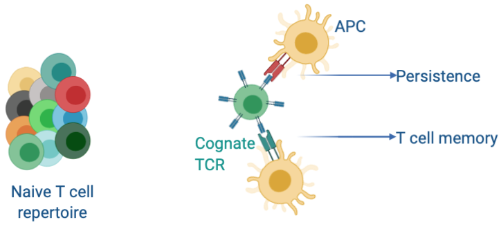
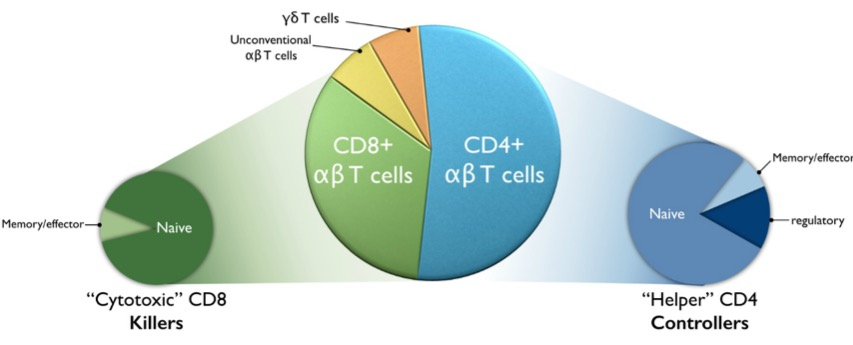
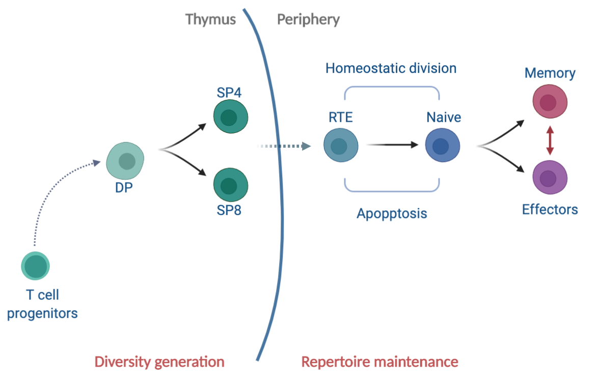
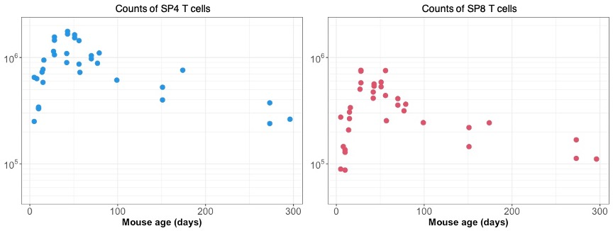

## .center[Naive T cells are cornerstones of adaptive immunity]
<hr>

### First rule of the immune system &mdash;  **Fight and remember.**</br>


.center[
<figure>
  
</figure>
]

???
Unlike the very popular fictional club of men who like to fight and not talk about it
the immune system fights anything and everything that pathogenically threatens our bodies,. remembers it and also make a big fuss about it.

and at the center of it all are naive T cells... which carry a unique receptor on their surface -- TCR - that specifically identifies proteins from pathogens or tumors and mount a robust response against it. 

Our bodies carry a vast array of naive T cells with different specificities to fight a wide range of novel and mutating pathogens. 


--

</br>

### A broad and long-lasting repertoire is crucial to protect against new infections throughout our lifetime.

???
Maintaining the size and breadth of naive T cell repertoire is paramount in protecting us against new infections throughout our lifetime.

---
class: middle
<hr>

- T cells are primarily categorized into $\small \text{CD4}^+  \text{ and CD8}^+$ cells depending on their co-receptor expression

- Naive T cells make up a large fraction of both CD4 and CD8 T cells.

</br>


```{r echo=FALSE, fig.retina=3}


```

<hr>

???
I will focus on the mechanisms that maintain the naive cd4 and cd8 T cell numbers and their repertoires in this talk.  

---

## Ecology of T lymphocytes
<hr>

```{r echo=FALSE, fig.retina=3, out.width='70%'}


```


### Naive T cell repertoire is shaped by **influx** from the thymus, and by **population dynamics** of naive T cells in peripheral lymphoid organs.


???
- 100% of the diversity generation happens in the thymus - a small gland in our chest.
naive cd4 and cd8 T cells emerge from thymic SP4 and SP8 subsets respectively.

- Naive t cells with new specificities are continuously exported from these thymic SP compartment into the peripheral lymphoid organs as RTE, which slowly mature into are basically young naive T cells.

- The clonal diversity and numbers of peripheral naive t cells are maintained by an aggregate effect of death, division and differentiation processes.

- In many ways it is an ecosystem - and understanding the development and maintenance of our immune repertoires requires quantifying this ecology.


<!---
Therefore the mechanisms that regulate these processes is crucial for understanding how naive t cell repertoire evolves across our lifespans.
There is some evidence in the field that the dynamics of RTE are different than naive T cells but there is no way to identify theem experimentally yet. So hard to untangle these processes. 
-->
---
name: naivedynamics-slide
class: inverse
background-image: url("figures/inverse_bg.png")

## .center[Dynamics in early life]
<hr>

### Thymic involution
- Thymus (a small gland in chest) starts shrinking from around 8 weeks of age in mice and from puberty in humans.

- Thymus halves in size every ~5 months in mice.

```{r echo=FALSE, fig.retina=3, out.width='75%'}


```

???

- There is a sharp increase in thymic cellularity early on in life but it starts shrinking starts shrinking from adulthood onwards &mdash; around 8 weeks of age in mice and from puberty in humans.

- Consequently SP4 and SP8 counts start falling.

- Since SP counts are proxy for thymic output/ new naive TCR production we can assume that most of the naive T cell repertoire gets established very early on in life and is just maintained throughout our lifetimes.


--

### A substantial fraction of naive T cell repertoire is established early on in life.


???

- This effect is probably even more extreme in humans, as thymus basically dries up by age 40


---

##  .center[Big questions]
<hr>

### What are the dynamics of naive T cell repertoire development?
- Is there clonal proliferation in periphery $\rightarrow$ forming large families?</br>
&#8618; Skews clone size distribution and lowers diversity.
- Is it all new specificities from the thymus? </br>
&#8618;Boosts diversity.

--

###  What are the rules of replacement within naive pool? 
- How do recent thymic immigrants fare against established naive T cells? </br>
&#8618; Maintenance of diversity over lifetime.

???
Are the new immigrants at an advantage or disadvantage relative to established naive T cells?
This has consequences on how diversity in maintained over lifetime.

--

### How are naive T cells maintained after thymic involution?
- Quorum sensing in naive T cell homeostasis to preserve the numbers?</br>
&#8618; Compensatory increase in cell division or decrease in turnover or both?


???
Is there Compensatory increase in cell division? or decrease in their loss? or both? 

---
## What we know and don’t know
<hr>

Most of our understanding of naive T cell homeostasis comes from studies in adult mice.</br>
&#8618; Relatively little is known about their neonatal dynamics.

--

### 1. Heterogeneity in naive T cell pool </br>
&#8594; We have shown that naive T cells' ability to persist in the circulation increases with their cell-age **(first-in-last-out rule).** 
- Shown in diverse experimental settings in adult mice. .right[Hogan _et. al._, PNAS 2015. Rane _et. al._ Plos Bio 2018].
</br>
- With the use of $C^{14}$ dating in humans (age: 20-65 years). .right[Mold _et. al._ Plos Bio 2019]
</br>

### Can cell-age dependence explain naive T cell development in neonatal niches?

???
Previously, we have shown that the persistence of naive T cells i.e. their net growth in both mice and humans increases gradually with their cell-age.
which provides a decent explanation for maintenance naive T cell numbers is adults and elderly.

However, if that is the case then what are the consequences on TCR repertoire diversity? 
is there inflation of clones that came out of thymus early on in life?

Also, we haven't tested this theory on naive T cells dynamics in neonates and are wondering whether it can explain the naive T cell development in neonatal niches?

---

### 2. Quorum sensing in naive T cell pool </br>
- Naive T cells have shown to undergo rapid division in profoundly lymphopenic conditions (>90% depletion). 
.right[Bourgeois and Stockinger, JI 2006]
</br>
&#8618;
Reduced competition for resources (IL-7 and self-MHC derived tonic signals).

- Does it manifest under normal conditions early in life? Is there reduced competition in neonates?

???
- There is an evidence for lymphopenia induced proliferation when naive T cell compartment is deplated > 90%.
Probably because of reduced competition for cytokine and MHC derived tonic signals.

- However it is not known whether it manifests early on in life? or is there any lymphopenia or reduced competiion in neonates.

--

</br>

### 3. Dynamics of Recent Thymic Emigrants </br>
- RTE within naive CD4 T cell pool are short-lived as compared to pre-existing naive T cells.

- No kinetic heterogeneity within naive CD8 T cell pool.

.right[van Hoeven Front. Imm. 2017]


???
RTE are hard to identify within the naive pool. Analysis of gfp labeling of thymic export and thymic transplants have shown that ...

<hr>

---
## .center[A unified model of naive T cell life-histories]
<hr>

### A single model that explains it all &mdash;  </br> 


- Dynamism in neonates and stability in adults. 


- How and why immunity wanes in elderly?


- Evolution of CD4 and CD8 repertoires and differences between them.</br>
&#8618; More skewing in CD8 repertoires than in CD4 repertoires.


- Prediction of T cell recovery upon depletion.</br>
&#8618; Reconstitution in HSC Transplants and in HIV patients.


???
So, mostly through this work we want to study the Mechanisms that regulate T cell pool sizes and in turn their clonal diversity across our lifespans.
**A model that explains it all** &xrarr; 

- How cd4 and cd8 repertoire evolve and how different they are


</br>

## .center[A quantitative map of our immune competence.]

???
Our goal is to understand the deterministic processes behind naive T cell maintenance and then use it simulate how TCR repertoire diversity evolves using gillespie algorithm or agent based models.

Also knowledge of thse mechanisms will definitly help us to understand how T cell pools are reconstituted in HSC Transplants and in HIV patients

<!---
?Is there LIP? Does the extent of reconstitution depend on the age of individual?
--->

---


###  .center[Potential mechanisms of naive T cell maintenance]
<hr>


```{r echo=FALSE, fig.retina=3, out.width='700', out.height='470'}

knitr::include_graphics("figures/model_concepts.png")
```


???
Mechanisms of naive T cell homeostasis fall into these 4 broad categories -

- Neutral - all naive T cell behave identical and obey simple rules of rendom birth-death processes.

- Where naive T cells compete for limiting resources.

- naive T cells accumulate changes over time that gives homeostatic advantage over relatively younger cells.

- where there is an inherent variation in fitness and fitter cells dominate the clonal distribution in the long run' 


---
class: inverse
background-image: url("figures/inverse_bg.png")

<hr>

- The adaptation model captured the naive T cell dynamics studied across multiple datasets generated in diverse experimental setups in adult mice.</br>
&#8618; Rest of the models in isolation failed with one ore more datasets.

???
Previously I had tested these models and only adaptation could multiple datasets generated across  diverse experimental setups by itself. in isolation rest all failed one ore more datasets.

However, we haven't ruled out the possibility that these models may be acting in conjunction to regulate naive T cell homeostasis.

--

- In previous studies, we modeled the **Net Growth (division - loss)** rate of naive T cells.</br>
&#8618; Untangling division and loss is crucial for understanding repertoire dynamics.
 
--

</br>

- $\small \text{Ki}67$ — a nuclear protein expressed during cell-division.</br>
&#8618; Independent handle on the rate of cell division.


.pull-left[
```{r echo=FALSE, fig.retina=3, out.width='250'}

knitr::include_graphics("figures/ki67_untangle.png")
```
]


.pull-right[
</br>
- T cells continue expressing Ki67 protein for ~ 4 days after the division.
.right[Hogan _et. al._, PNAS 2015]

**Thymic Inheritance or division in periphery?**
]

--

</br>

- Modeling **‘division history’** is crucial for understanding B cell development.

.right[Verheijen _et. al._ Cell Reports 2020]

<hr>

???
We haven't tried combination of one more processes - which may explain data better than the single model.


