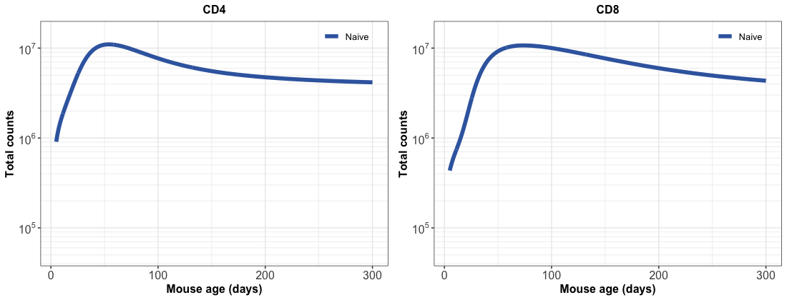

## .center[Diversity and Numbers]
<hr>


```{r echo=FALSE, fig.retina=3, out.width='1000', out.height='450'}

knitr::include_graphics("figures/intro_slide.png")
```


???
This work focuses on understanding the dynamics of naive T cells,
which are Ag-inexperinced T cells and are primarily reponsible for mounting adaptive immune response against novel pathogens that our bodies havent seen yet. e.g. coronavirus now

Therefore maintaining their numbers and a diverse repertoire TCR clones within the nai t cell population is crucial.

100% of the diversity generation happens in thymus where T cell progenitors undergo a series of maturation steps to give rise to DP cell which differentiate into SP CD4 and SP CD8 cells after thymic selection events.

These SP4 and SP8 cells are exported intoniave pool in peripheral lymhoid organs as RTE, which are basically young naive T cells.

- The clonal diversity and numbers of periph nai t cells are maintained by an aggregate effect of death, division and differentiation processes.
Therefore the mechanisms that regulate these processes is crucial for understanding how naive t cell repertoire evolves across our lifespans.

<!---
There is some evidence in the field that the dynamics of RTE are different than naive T cells but there is no way to identify theem experimentally yet. So hard to untangle these processes. 
-->
---
## .center[Naive T cell dynamics in mice]
<hr>

```{r echo=FALSE, fig.retina=3}


```
--
count: false

</br>

Naive CD4 and CD8 T cell numbers increase rapidly early in life, peak around 8 weeks of age and decline slowly thereafter $(t_{1/2} \sim 160d)$.


???
read the slide.


---
count: false

## .center[Naive T cell dynamics in mice]
<hr>


```{r echo=FALSE, fig.retina=3}

knitr::include_graphics("figures/intro_counts2.png")
```

???
The sharp increase in naive T cells in neonates matches closely with their thymic prcursors.

--
name: naivedynamics-slide
count: false

</br>
In humans, the thymic contribution to naive T cell maintenance diminishes significantly post thymic-involution (puberty) as compared to in mice.
.right[den Braber _et. al._ Immunity 2012]

???
The thymus undergoes a process of involution around 7/8 weeks of age in mice and around puberty in humans and the thymic export of naive T cells decreases substantially thereafter.
However, naive T cell numbers in periphery are maintained quite stably till very late in life in both mice and humans.


---

##  .center[How are T cell pools established early on in life?]
<hr>

</br>

### Thymic cellularity increases dramatically within first 7-8 weeks of age.
- Rapid influx of new naive T cells into the growing T cell compartments.

--

</br>

### Lymphopenia induced proliferation (LIP) -  naive T cells divide rapidly in empty niches.

- In neonates T cell niches are still delveloping. **Is there space for expansion?**

- Skewing of TCR repertoire? T cells coming out early on in life are over-represented. Is it uniform? Or inherent variation?


???
- In neonates, there is a rapid and growing influx of thymic cells into relatively empty naive T cell compartments.

It seems that thymic influx heavily dominates naive T cell dynamics at this stage.

- It has been shown that the >80-90% depletion of naive T cells induces a rapid and substantial division of naive T cells in the low density populations called as LIP.

Conventionally, naive T cell development in neonates has also been linked with LIP, however, we have to understand that the tissues are still relatively small in in young mice and the naive T cell niches are still growing at this stage -> so is there enough space and resources available for LIP?


It is suffice to say the **Neonatal naive T cell pools are dynamically maintained**

?Force of recruitment into memory early on in life?


---

##  .center[What happens after thymic involution?]
<hr>

</br>

### Do naive T cell dynamics differ between neonates and adults?
- Compensatory increase in cell division? or decrease in loss? or both?

???
If you recall that naive T cell numbers are maintained stably even after thymic involution.
Is there Compensatory increase in cell division? or decrease in their loss? or both? in adult stages.


--

### Cell-age dependence &mdash;

- Naive T cell persistance (division - loss) increases gradually with their age (time since thymic exit), in mice and humans .
.right[Rane _et. al._ Plos Bio 2018, Mold _et. al._ Plos Bio 2019]

- Consequences on TCR repertoire diversity?

- Can it explain naive T cell development in dynamic neonatal niches?

???
Previously, we have shown that the persistance of naive T cells i.e. their net growh in both mice and humans increases gradually with their cell-age.
which provides a decent explanation for maintaing naive T cell numbers is adults and elderly.

However, if that is the case then what are the consequences on TCR repertoire diversity? 
is there inflation of clones just beacuse they came out of thymus early on in life?

Also, we havent tested this theory on naive T cells dynamics in neonates and are wondering whether it can explain the naive T cell development in dynamic neonatal niches?
---

class: inverse
background-image: url("figures/inverse_bg.png")


<hr>

</br>

### Mechanisms that regulate T cell pool sizes across our lifespans.
- **A model that explains it all** &xrarr; Dynamism in neonates and stability in adults. 

???
So, mostly through this work we want to study the Mechanisms that regulate T cell pool sizes and in turn their clonal diversity across our lifespans.
**A model that explains it all** &xrarr; Dynamism in neonates and stability in adults. 

--

### TCR Repertoire diversity.
- How clonal populations establish and evolve? &xrarr; Simulating their dynamics (Gillespie algorithm or Agent-based models).

???
Our goal is to understand the deterministic processes behinda naive T cell maintenance and then use it simulate how TCR repertoire diversity evolves using gillespie algorithm or agent based models.

--

### Recovery of T cell pools upon depletion.

- How naive T cell pools are restored and restablished upon T cell depletion (e.g. in HSC Transplants and in HIV patients)?


???
Also knowledge of thse mechanisms will definitly help us to understand how T cell pools are reconstituted in HSC Transplants and in HIV patients


?Is there LIP? Does the extent of reconstitution depend on the age of individual?


