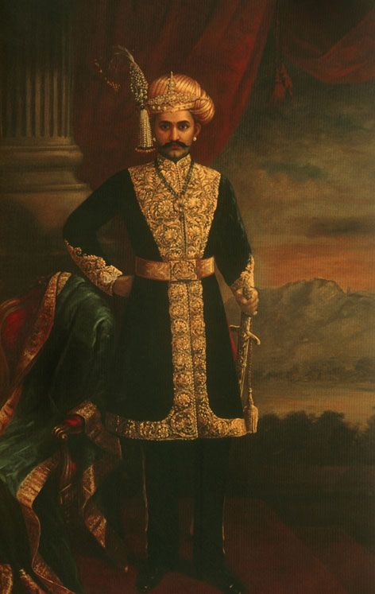
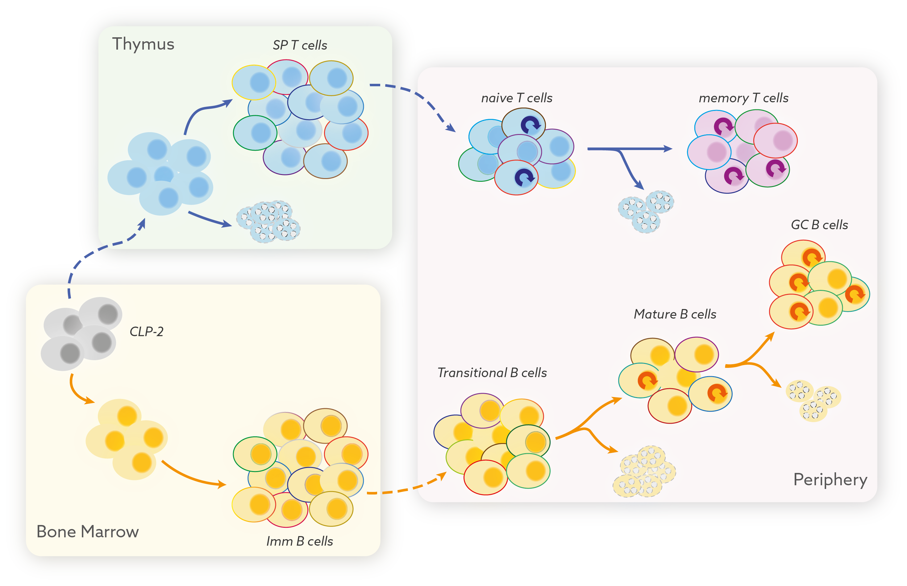
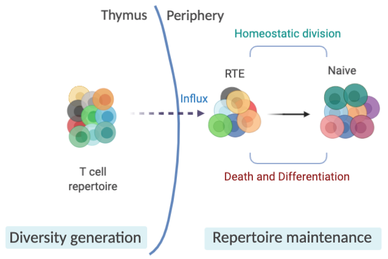
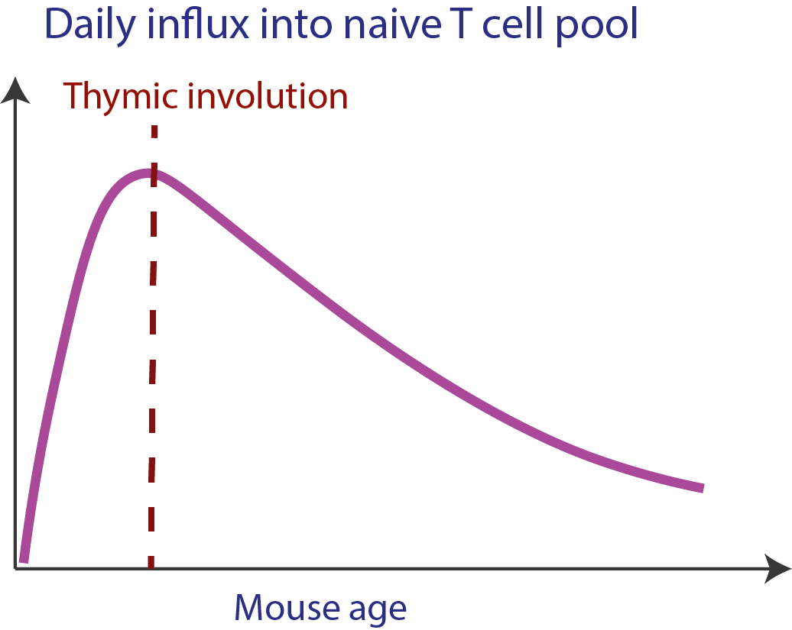
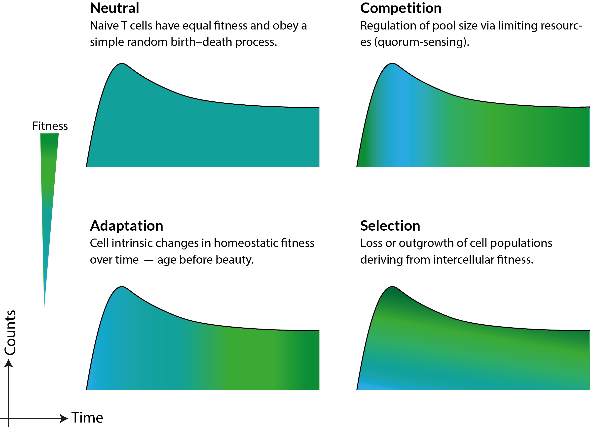

class: inverse
background-image: url("figures/inverse_bg.png")

## .center[The Emperor and the Golem]
<hr>

.pull-left[
<figure>
  
</figure>
]

--

<figure>
  
</figure>

--

- <h3 style="color:#fcba03; font-size:150%"> Specifically identify and destroy 'foreign'. </h3>
  <p style="color:gray50; font-size:80%"> &#8594; Large army for countless possibilities.</p>


--

- <h3 style="color:#fcba03; font-size:150%"> Recognize our own.  </h3>
  <p style="color:gray50; font-size:80%"> &#8594; Remove that pose threat to 'self'.</p>

--

- <h3 style="color:#fcba03; font-size:150%"> Remember and respond faster next time.</h3>

---
class: inverse, center, middle
background-image: url("figures/inverse_bg.png")

## .center[The Golems of our immune system]

```{r echo=FALSE, fig.retina=3}


```

---
### .center[Subset composition of T cells]
<hr>

T cells are primarily categorized into $\small \text{CD4}^+  \text{ and CD8}^+$ cells.


```{r echo=FALSE, fig.retina=3}

knitr::include_graphics("figures/naive_composition.jpg")
```

--

</br>

<h2 style="color:#9e423c; font-size:200%">.center[Naive T cells make up a large fraction of these subsets.] </h2>


???

---
class: center
## .center[Naive T cells are cornerstones of adaptive immunity]
<hr>

.left[
### * Naive T lymphocytes -- 
  - Identify 'specific antigens' on pathogens and tumors.
  - Continuously circulate within lymphatic system in search of antigens.
  - Differentiate into memory and effector T cells.
]
--

</br>

<h3> Naive T cells play a central role in fights against novel and mutating pathogens.</h3>

--

<big><big><big><big> <big>	<span style="color:#9e423c;">&#11015;</span>  </big></big></big></big></big>

<h3 style="color:#9e423c;">
A broad and long-lasting naive repertoire is crucial to protect against new infections throughout our lifetime.
</h3>

???
Unlike the very popular fictional club of men who like to fight and not talk about it
the immune system fights anything and everything that pathogenically threatens our bodies,. remembers it and also make a big fuss about it.

and at the center of it all are naive T cells... which carry a unique receptor on their surface -- TCR - that specifically identifies proteins from pathogens or tumors and mount a robust response against it. 

Our bodies carry a vast array of naive T cells with different specificities to fight a wide range of novel and mutating pathogens. 


There are two types of T cells ones that express CD4 conventionally knows and Thelper cells and the others express cd8 protein -- cytotoxic/killer T cells.

Maintaining the size and breadth of naive T cell repertoire is paramount in protecting us against new infections throughout our lifetime.

I will focus on the mechanisms that maintain the naive cd4 and cd8 T cell numbers and their repertoires in this talk.  

---

### Complexity & Dynamism in naive T cell homeostasis:
<hr>

```{r echo=FALSE, fig.retina=3, out.width='50%'}


```


--

> Multiple processes regulate the numbers and diversity of naive T cells.

> Contribution of these processes to naive T cell maintenance may vary with time.

--

</br>

.center[
<h3 style="color:#9e423c;">
Understanding the development and maintenance of our T cell repertoires requires quantifying their ecology.

</h3>
]

<hr>

???
- 100% of the diversity generation happens in the thymus - a small gland in our chest.
naive cd4 and cd8 T cells emerge from thymic SP4 and SP8 subsets respectively.

- Naive t cells with new specificities are continuously exported from these thymic SP compartment into the peripheral lymphoid organs as RTE, which slowly mature into are basically young naive T cells.

- The clonal diversity and numbers of peripheral naive t cells are maintained by an aggregate effect of death, division and differentiation processes.

- In many ways it is an ecosystem - We need to quantify T cell ecology to understand the development and maintenance of our immune repertoires.


<!---
Therefore the mechanisms that regulate these processes is crucial for understanding how naive t cell repertoire evolves across our lifespans.
There is some evidence in the field that the dynamics of RTE are different than naive T cells but there is no way to identify theem experimentally yet. So hard to untangle these processes. 
-->
---
name: naivedynamics-slide
## Influx into the naive pool
<hr>

* Thymic involution: 
     > Thymus starts shrinking from around 8 weeks of age in mice (halves in size every ~5 months) and from puberty in humans.

</br>

.pull-left[
```{r echo=FALSE, fig.retina=3, out.width='68%'}


```
]

--

</br>

<h3 style="font-size:140%;">
&#8658; Fewer and fewer new cells enter the naive compartment.
</h3>

--

<h3 style="font-size:140%;">
&#8658; Diminished inflow of new specificities.
</h3>

--

</br>
</br>

.center[
<h3 style="color:#9e423c;">
Thymic involution strongly impacts naive T cell numbers and repertoire diversity.
</h3>
]

???
- There is a sharp increase in thymic cellularity early on in life but it starts shrinking starts shrinking from adulthood onwards &mdash; around 8 weeks of age in mice and from puberty in humans.

- Consequently SP4 and SP8 counts start falling.

- Since SP counts are proxy for thymic output/ new naive TCR production we can assume that most of the naive T cell repertoire gets established very early on in life and is just maintained throughout our lifetimes.

The influx of new specificities into the naive pool diminishes significantly after thymic involution.

- This effect is probably even more extreme in humans, as thymus basically dries up by age 40

---

## Big Questions
<hr>

--

<h3>
&#128161; Is the majority of T cell repertoire established early on in life (pre-involution)?
</h3> 

--

<h3>
&#128161; What are the dynamics of its establishment?
</h3> 
   - Is there clonal proliferation in periphery $\rightarrow$ forming large clonal families?</br>
   &#8618; **Skews clone size distribution and lowers diversity.**
   - Is it all new specificities from the thymus? </br>
   &#8618; **Enhances diversity.**

---
<hr>
<h3>
&#128161; How are naive T cells maintained after thymic involution?
</h3> 

- **Quorum sensing** to preserve the numbers? </br>
&#8618; Compensatory increase in cell division or decrease in turnover or both?

--

<h3 style="color:#9e423c;">
&#8658; Can this explain the collapse in repertoire diversity in old ages?
</h3>

--

</br>

### &#128161; What are the rules of replacement within naive pool? 
- Is it purely stochastic?

--

- Do new immigrants displace pre-existing cells? 

- Homeostatic advantage for relatively older cells?

--

<h3 style="color:#9e423c;">
&#8658; Consequences on how diversity in maintained over lifetime.
</h3>

<hr>

---

## What we know and don’t know
<hr>

Most of our understanding of naive T cell homeostasis comes from studies in adult mice.</br>
&#8618; Relatively little is known about their neonatal dynamics.

--

### 1. Heterogeneity in naive T cell pool </br>
&#8594; We have shown that naive T cells' ability to persist in the circulation increases with their cell-age **(first-in-last-out rule).** 
- Shown in diverse experimental settings in adult mice.
.right[
<span style="color:#606060; font-weight:900; font-size:90%;"> 
Hogan _et. al._, PNAS 2015. Rane _et. al._ Plos Bio 2018
</span>
]


</br>
- With the use of $C^{14}$ dating in humans (age: 20-65 years).

.right[
<span style="color:#606060; font-weight:900; font-size:90%;"> 
Mold _et. al._ Plos Bio 2019
</span>
]

--

<h3 style="color:#9e423c;">
Can cell-age dependence explain naive T cell development in neonatal niches?
</h3>

???
Previously, we have shown that the persistence of naive T cells i.e. their net growth in both mice and humans increases gradually with their cell-age.
which provides a decent explanation for maintenance naive T cell numbers is adults and elderly.

However, if that is the case then what are the consequences on TCR repertoire diversity? 
is there inflation of clones that came out of thymus early on in life?

Also, we haven't tested this theory on naive T cells dynamics in neonates and are wondering whether it can explain the naive T cell development in neonatal niches?

---

### 2. Quorum sensing in naive T cell pool </br>
- Naive T cells have shown to undergo rapid division in profoundly lymphopenic conditions (>90% depletion). 

.right[
<span style="color:#606060; font-weight:900; font-size:90%;"> Bourgeois and Stockinger, JI 2006 </span>
]

&#8618;
Reduced competition for resources (IL-7 and self-MHC derived tonic signals).

- Does it manifest under normal conditions early in life?

- Is there reduced competition in neonates?

--

???
- There is an evidence for lymphopenia induced proliferation when naive T cell compartment is deplated > 90%.
Probably because of reduced competition for cytokine and MHC derived tonic signals.

- However it is not known whether it manifests early on in life? or is there any lymphopenia or reduced competiion in neonates.

--

</br>

### 3. Dynamics of Recent Thymic Emigrants </br>
- RTE within naive CD4 T cell pool are short-lived as compared to pre-existing naive T cells.

- No kinetic heterogeneity within naive CD8 T cell pool.

.right[
<span style="color:#606060; font-weight:900; font-size:90%;"> van Hoeven Front. Imm. 2017 </span>
]

???
RTE are hard to identify within the naive pool. Analysis of gfp labeling of thymic export and thymic transplants have shown that ...

<hr>

---
class: inverse
background-image: url("figures/inverse_bg.png")

## .center[A unified model of naive T cell life-histories]
<hr>

### A single model that explains it all &mdash;  </br> 

<h3 style="color:#fcba03; font-size:150%;">
&#8658; Dynamism in neonates and stability in adults. 
</h3>

--

<h3 style="color:#fcba03; font-size:150%;">
&#8658; How and why does our immunity wanes with age?
</h3>

--

<h3 style="color:#fcba03; font-size:150%;">
&#8658; Evolution of CD4 and CD8 repertoires and differences between them.
</h3>
  - More skewing in CD8 repertoires than in CD4 repertoires.

--

<h3 style="color:#fcba03; font-size:150%;">
&#8658; Prediction of T cell recovery upon depletion.
</h3>
  - Reconstitution in HSC Transplants and in HIV patients.


???
So, mostly through this work we want to study the Mechanisms that regulate T cell pool sizes and in turn their clonal diversity across our lifespans.
**A model that explains it all** &xrarr; 

- How cd4 and cd8 repertoire evolve and how different they are


</br>

## .center[A quantitative map of our immune competence.]

???
Our goal is to understand the deterministic processes behind naive T cell maintenance and then use it simulate how TCR repertoire diversity evolves using gillespie algorithm or agent based models.

Also knowledge of thse mechanisms will definitly help us to understand how T cell pools are reconstituted in HSC Transplants and in HIV patients

<!---
?Is there LIP? Does the extent of reconstitution depend on the age of individual?
--->

---


##  .center[Potential mechanisms of naive T cell maintenance]
<hr>


```{r echo=FALSE, fig.retina=3, out.width='85%'}


```


???
Mechanisms of naive T cell homeostasis fall into these 4 broad categories -

- Neutral - all naive T cell behave identical and obey simple rules of rendom birth-death processes.

- Where naive T cells compete for limiting resources.

- naive T cells accumulate changes over time that gives homeostatic advantage over relatively younger cells.

- where there is an inherent variation in fitness and fitter cells dominate the clonal distribution in the long run' 


---

## Story so far...
<hr>

</br>

```{css, echo = FALSE}
caption {
      color: #035AA6;
      font-weight: bold;
      font-size: 1.2em;
    }
```

```{r echo=FALSE, fig.retina=3}
## function for exporting a data table of delta loo ic values and akaike weights
#takes 2 separate lists of the name of the models and loo-ic values
library(kableExtra)

data_vec <- c("Cell counts in Wild Type mice",
              "Cell counts in Thymectomised mice",
              "Donor fractions in Busulfan BM chimeras",
              "Kinetics of adoptively transferred cells")

df <- data.frame(
  "Dataset" = data_vec,
  "Neutral" = c("\u2713", "\u2717", "\u2717", "\u2014"),
  "Competition" = c("\u2713", "\u2713", "\u2717", "\u2014"),
  "Selection" = c("\u2713", "\u2713", "\u2713", "\u2717"),
  "Adaptation" = c("\u2713", "\u2713", "\u2713", "\u2713")
)

df %>%
  kable(caption = "Table: Summary of previous results", align = c('l', rep('c', 4))) %>%
  kable_styling(font_size = 15) %>%
  column_spec(5, color =  'green', bold = TRUE)

```

.right[
<span style="color:#606060; font-weight:900; font-size:90%;"> Rane _et. al._ Plos Bio 2018 </span>
]


  - The adaptation model captured the naive T cell dynamics across **multiple datasets** generated in **diverse experimental setups** in adult mice.
  
  - Rest of the models when tested in isolation failed with one or more datasets.

--

.center[
### Different combinations of models?
]

.right[continued...]

???
- The adaptation model captured the naive T cell dynamics studied across multiple datasets generated in diverse experimental setups in adult mice.</br>
&#8618; Rest of the models in isolation failed with one or more datasets.

Previously I had tested these models and only adaptation could multiple datasets generated across  diverse experimental setups by itself. in isolation rest all failed one ore more datasets.

However, we haven't ruled out the possibility that these models may be acting in conjunction to regulate naive T cell homeostasis.

Different mechanisms may act in conjunction to regulate naive T cell homeostasis.

---

<h3 style="font-size:140%;">
Untangling division and loss:
</h3> 

- Previous studies estimated **Net Growth (division - loss)** rate of naive T cells.</br>
<h3 style="font-size:120%;">
&#8658; Separating the effects of division and loss is crucial for studying lymphocyte dynamics.
</h3> 
.right[
<span style="color:#606060; font-weight:900; font-size:90%;"> Verheijen & Rane _et. al._ Cell Reports 2020</span>
]
 
--

- $\small \text{Ki}67$ — a nuclear protein expressed during cell-division.</br>
&#8618; Independent handle on the rate of cell division.


.pull-left[
```{r echo=FALSE, fig.retina=3, out.width='250'}

knitr::include_graphics("figures/ki67_untangle.png")
```
]


.pull-right[
</br>
- T cells continue expressing Ki67 protein for ~ 4 days after the division.
.right[
<span style="color:#606060; font-weight:900; font-size:90%;"> Hogan _et. al._, PNAS 2015</span>
]

**Thymic Inheritance or division in periphery?**
]

--


.center[
<h3 style="color:#9e423c;">
Modeling division-history is crucial for understanding how repertoires evolve.
</h3> 
]

<hr>

???
We haven't tried combination of one more processes - which may explain data better than the single model.


