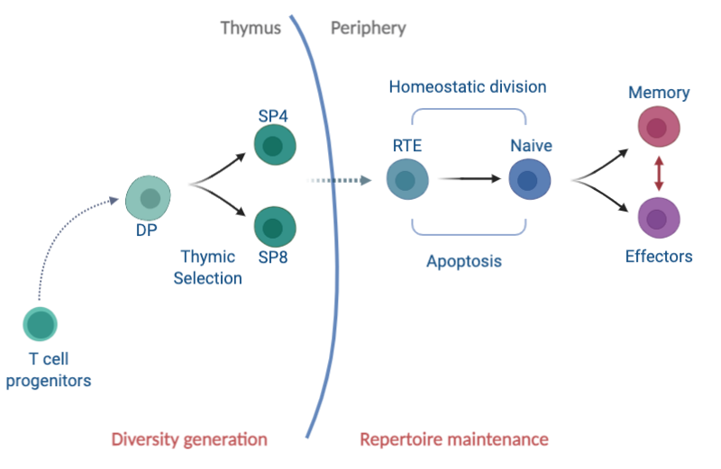

## .center[Naive T cells are cornerstones of adaptive immunity]
<hr>

### First rule of the immune system &mdash;  **Fight and remember.**</br>


.center[
<figure>
  
</figure>
]

--

</br>


### A diverse naive T cell repertoire is needed to fight novel and mutating pathogens.


### Broad and long-lasting repertoire is crucial to protect against new infections throughout our lifetime.

???
Unlike the very popular fictional club of men who like to fight with each other 
the first rule of ....
and make a big fuss about it.

and naive T cells are at the center of it.


Durable immunity against infections relies on naive T cells recognizing the novel pathogens using T cell receptor (TCR).

- A diverse TCR repertoire in naive T cell pool is needed to protect against a wide range of novel and mutating pathogens. 

Maintaining the size and breadth of naive T cell repertoire is equally imp to protect against new infections throughout our lifetime.
---

## Ecology of T lymphocytes
<hr>

```{r echo=FALSE, fig.retina=3, out.width='70%'}


```


### Naive T cell repertoire is shaped by **influx** from the thymus, and by **population dynamics** of naive T cells in peripheral lymphoid organs.


???
100% of the diversity generation happens in thymus where T cell progenitors undergo a series of maturation steps to give rise to DP cell which differentiate into SP CD4 and SP CD8 cells after thymic selection events.

These SP4 and SP8 cells are exported into niave pool in peripheral lymhoid organs as RTE, which are basically young naive T cells.

- The clonal diversity and numbers of periph nai t cells are maintained by an aggregate effect of death, division and differentiation processes.
Therefore the mechanisms that regulate these processes is crucial for understanding how naive t cell repertoire evolves across our lifespans.

In many ways it is an ecosystem - and understanding the development and maintenance of our immune repertoires involves quantifying this ecology.


<!---
There is some evidence in the field that the dynamics of RTE are different than naive T cells but there is no way to identify theem experimentally yet. So hard to untangle these processes. 
-->
---
name: naivedynamics-slide
class: inverse
background-image: url("figures/inverse_bg.png")

## .center[Dynamics in early life]
<hr>

### Thymic involution
- Thymus (a small gland in chest) starts shrinking from around 8 weeks of age in mice and from puberty in humans.

- Thymus halves in size every ~5 months in mice.


```{r echo=FALSE, fig.retina=3, out.width='70%'}

knitr::include_graphics("figures/intro_counts2.png")
```


### A substantial fraction of naive T cell repertoire is established early on in life.


???
Thymus (a small gland in chest) starts shrinking from around 8 weeks of age in mice and from puberty in humans.
- Consequently SP4 and SP8 counts start falling.

- SP counts are proxy for thymic output/ new naive TCR production.

- Probably even more extreme in humans, as thymus basically dries up by age 40

</br>
In humans, the thymic contribution to naive T cell maintenance diminishes significantly post thymic-involution (puberty) as compared to in mice.
.right[den Braber _et. al._ Immunity 2012]

???
The thymus undergoes a process of involution around 7/8 weeks of age in mice and around puberty in humans and the thymic export of naive T cells decreases substantially thereafter.
However, naive T cell numbers in periphery are maintained quite stably till very late in life in both mice and humans.


---

##  .center[Big questions]
<hr>

### What are the dynamics of naive T cell repertoire development?
- Is there clonal proliferation in periphery $\rightarrow$ forming large families?</br>
&#8618; Skews clone size distribution and lowers diversity.
- Is it all new specificities from the thymus? </br>
&#8618;Boosts diversity.

--

###  What are the rules of replacement within naive pool? 
- How do recent thymic immigrants fare against established naive T cells? </br>
&#8618; Maintenance of diversity over lifetime.

--

### How are naive T cells maintained after thymic involution?
- Quorum sensing in naive T cel homeostasis to preserve the numbers?</br>
&#8618; Compensatory increase in cell division or decrease in turnover or both?


???
This matters for maintenance of diversity over life

If you recall that naive T cell numbers are maintained stably even after thymic involution.
Is there Compensatory increase in cell division? or decrease in their loss? or both? in adult stages.

---
## What we know and don’t know
<hr>

Most of our understanding of naive T cell homeostasis comes from adult mice.


### 1. Heterogeneity in naive T cell pool </br>
&#x1F4D6; We have shown that naive T cells' ability to persist in the circulation increases with their cell-age **(first-in-last-out rule).** 
- Shown in diverse experimental settings in mice. .right[Hogan _et. al._ PNAS 2015. Rane _et. al._ Plos Bio 2018].
</br>
- With the use of $C^{14}$ dating in humans. .right[Mold _et. al._ Plos Bio 2019]
</br>

### Can cell-age dependence explain naive T cell development in neonatal niches?

???
Previously, we have shown that the persistence of naive T cells i.e. their net growth in both mice and humans increases gradually with their cell-age.
which provides a decent explanation for maintain naive T cell numbers is adults and elderly.

However, if that is the case then what are the consequences on TCR repertoire diversity? 
is there inflation of clones just because they came out of thymus early on in life?

Also, we haven't tested this theory on naive T cells dynamics in neonates and are wondering whether it can explain the naive T cell development in neonatal niches?

---

### 2. Quorum sensing in naive T cell pool </br>
- Naive T cells have shown to undergo rapid division in profoundly lymphopenic conditions (>90% depletion). 
.right[Bourgeois and Stockinger, JI 2006]
</br>
&#8618;
Reduced competition for resources (IL-7 and self-MHC derived tonic signals).

- Does it manifest under normal conditions early in life? Is there reduced competition in neonates?

--

### 3. Dynamics of Recent Thymic Emigrants </br>
- RTE within naive CD4 T cell pool are short-lived as compared to pre-existing naive T cells.

- No kinetic heterogeneity within naive CD8 T cell pool.

.right[van Hoeven Front. Imm. 2017]

<hr>

---
## .center[A unified model of naive T cell life-histories]
<hr>

### A single model that explains it all &mdash;  </br> 


- Dynamism in neonates and stability in adults. 


- How and why immunity wanes in elderly?


- Evolution of CD4 and CD8 repertoires and differences between them.</br>
&#8618; More skewing in CD8 repertoires than in CD4 repertoires.


- Prediction of T cell recovery upon depletion.</br>
&#8618; Reconstitution in HSC Transplants and in HIV patients.

--

</br>

## .center[A quantitative map of our immune competence.]

???
### A quantitative map of our immune competence.

So, mostly through this work we want to study the Mechanisms that regulate T cell pool sizes and in turn their clonal diversity across our lifespans.
**A model that explains it all** &xrarr; Dynamism in neonates and stability in adults. 

Our goal is to understand the deterministic processes behind naive T cell maintenance and then use it simulate how TCR repertoire diversity evolves using gillespie algorithm or agent based models.

Also knowledge of thse mechanisms will definitly help us to understand how T cell pools are reconstituted in HSC Transplants and in HIV patients


?Is there LIP? Does the extent of reconstitution depend on the age of individual?


---


###  .center[Potential mechanisms of naive T cell maintenance]
<hr>


```{r echo=FALSE, fig.retina=3, out.width='700', out.height='470'}

knitr::include_graphics("figures/model_concepts.png")
```


---
class: inverse
background-image: url("figures/inverse_bg.png")

<hr>

- The adaptation model provided the most parsimonious explanation of multiple sets of observations of naive T cell dynamics in adult mice.</br>
&#8618; Rest of the models in isolation failed with one ore more datasets.

--

- Previously, we studied the **Net Growth (division - loss)** of naive T cells.</br>
&#8618; Untangling division and loss is crucial for understanding repertoire dynamics.

--

- $\small \text{Ki}67$ — a nuclear protein expressed during cell-division.</br>
&#8618; Independent handle on the rate of cell division.

--


</br>

.pull-left[
```{r echo=FALSE, fig.retina=3, out.width='250'}

knitr::include_graphics("figures/ki67_untangle.png")
```
]


.pull-right[
</br>
- T cells continue expressing Ki67 protein for ~ 4 days after the division.
.right[Hogan _et. al._, PNAS 2015]

**Thymic Inheritance or division in periphery?**
]

--

</br>

- Modeling **‘division history’** is crucial for understanding B cell development.

.right[Verheijen _et. al._ Cell Reports 2020]
<hr>

???
We haven't tried combination of one more processes - which may explain data better than the single model.


