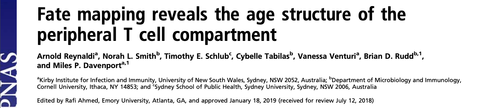
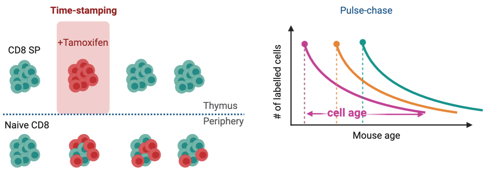
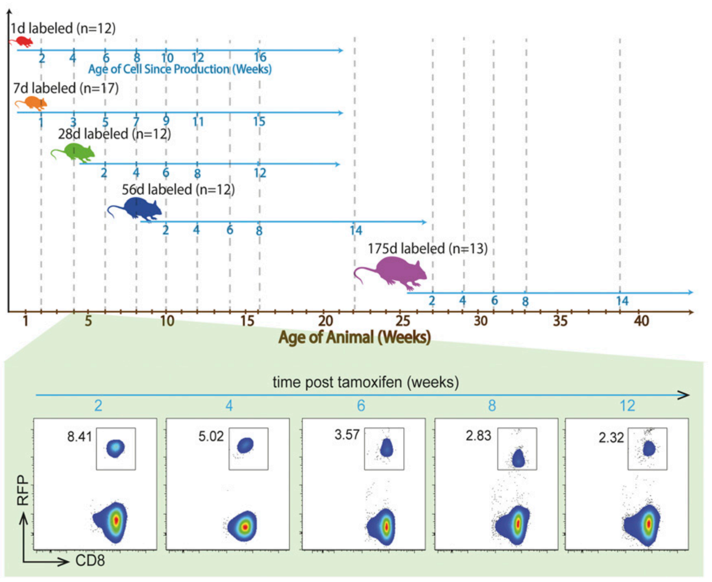

class: center, middle

### A good test of a model is its versatility in explaining multiple datasets generated in diverse experimental settings.

---

class: inverse
background-image: url("figures/inverse_bg.png")


### Malleability of the models
<hr>


```{r echo=FALSE, fig.retina=3, out.width='750'}


```

</br>

???
A good test of a model is its versatility in explaining multiple datasets generated in diverse experimental settings.

<p style="color:navy;">A good test of a model is its versatility in explaining multiple datasets generated in diverse experimental settings.</p>

--

```{r echo=FALSE, fig.retina=3, out.width='750'}


```

???

class: center, middle

```{r echo=FALSE, fig.retina=3, out.width='600'}


```

---

class: center
## Summary

--

## Whats Next?
---

class: center, middle

# Thanks!

Slides created via the R package [**xaringan**](https://github.com/yihui/xaringan).

The chakra comes from [remark.js](https://remarkjs.com), [**knitr**](http://yihui.name/knitr), and [R Markdown](https://rmarkdown.rstudio.com).
