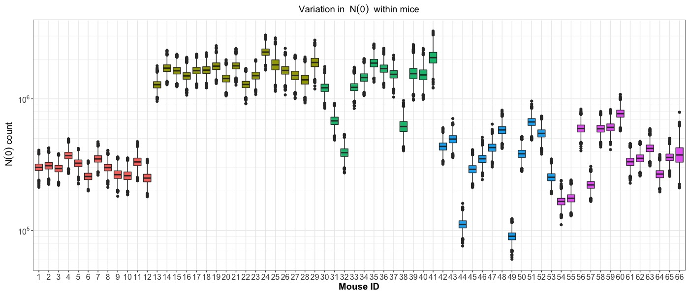
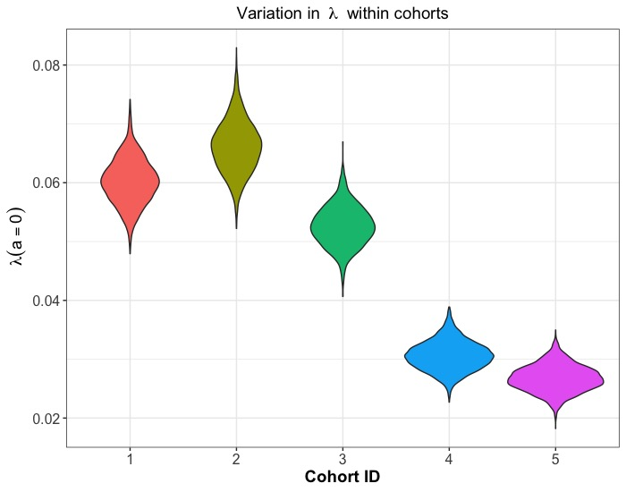
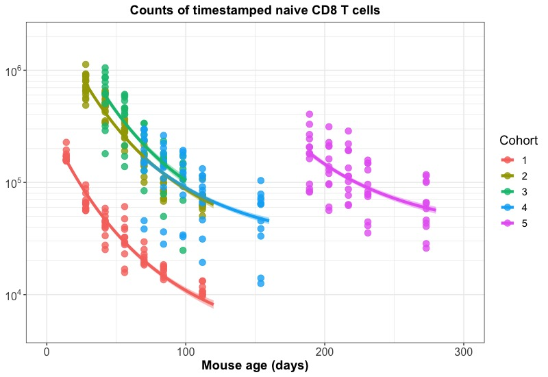
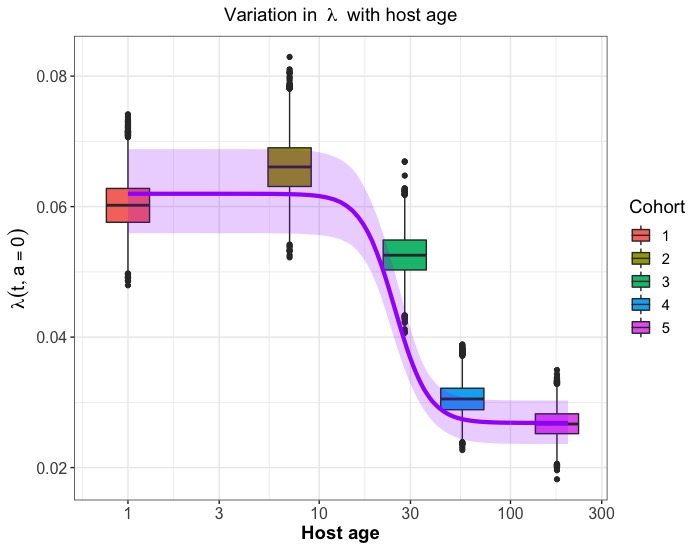
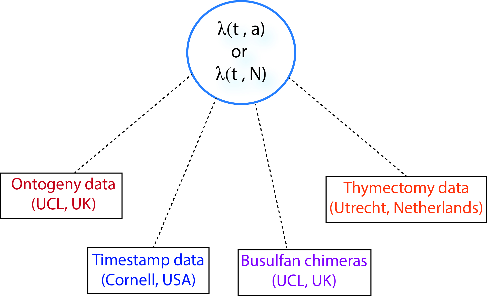

class: inverse
background-image: url("figures/inverse_bg.png")

<hr>
</br>


```{r echo=FALSE, fig.retina=3, out.width='750'}

knitr::include_graphics("figures/timestamp_paper.png")
```

</br>

???
count: false

class: center, middle

### A good test of a model is its versatility in explaining multiple datasets generated in diverse experimental settings.

<p style="color:navy;">A good test of a model is its versatility in explaining multiple datasets generated in diverse experimental settings.</p>

--

```{r echo=FALSE, fig.retina=3, out.width='750px'}

knitr::include_graphics("figures/ts_strategy1.png")
```

<hr>
---

<hr>

```{r echo=FALSE, fig.retina=3, out.width='65%'}


```

--

</br>

### <u>Need for Hierrarchical modelling:</u>

- **Pooling information among cohorts** while fitting models.

--

- Within cohorts **repeat sampling on individual mice** &mdash; Pooling information among mice.

<hr>

???
- The slope of 'decay curve' informs on the dependence of <strong>net loss rate</strong> (death - division) on cell-age.


- The difference in in slopes of each cohort informs on effects of host age.

</br>

---
### Hierarchical age-structured model
<hr>

No information on cell division in this system </br>
&#8618; We track cell-age in this system using,

.shadedbox2[
$$
\small
\begin{aligned}
\frac{\partial N}{\partial t} + \frac{\partial N}{\partial a} = -\lambda(a) \,\, N(t, a), 
\end{aligned}
$$
]

where, net loss rate $\small \rightarrow \lambda = \delta - \rho$
<span style="color:#035AA6;">
$\quad \Rightarrow \quad \quad \small  \lambda(a) = \lambda_0 \, e^{-\gamma \, a}$
</span>

<hr>
--

### <u>Model:</u>

$$
\small
\begin{aligned}
&y_i \sim \text{normal}(\mu_i, \sigma) \quad \quad \quad \quad \quad \quad  &[\text{likelihood}] \\
&\mu_i = f(\text{time}_i, N_0, \lambda_0, \gamma)  &[\text{model}]\\
&\gamma \sim \text{normal}(0.05, 0.01) &[\gamma \text{ prior}]
\end{aligned}
$$


<span style="color:#035AA6;">
$$
\small
\begin{aligned}
&\text{Hyper parameters} \\
&N_0 \sim \text{normal}(\mu_N, \sigma_N) \quad \quad \quad  &[\text{Initial counts}]  \\
&\lambda_0 \sim \text{normal}(\mu_{\lambda}, \sigma_{\lambda})   &[\text{Loss rate at age=0}] 
\end{aligned}
$$
</span>

<hr>

???
Since we have no information on cell division in this system,
ASM reduces down to a 2-dimensional PDE.

- $\small \gamma$ - the rate with which $\small \lambda_0$ varies with cell-age _i.e._ 
$\small \lambda_0 \, e^{-\gamma \,a}$. 


---
<hr>
</br>


```{r echo=FALSE, fig.retina=3}
library(kableExtra)
model_compare <- function(looiclist){
  deltaloo_list <- looiclist - min(looiclist) # delta loo-ic
  akaikewt_numerator <- function(x) exp(-0.5 * x) ## akaike wt
  akaikewt_list <- sapply(deltaloo_list, akaikewt_numerator) * 100/sum(exp(- 0.5 * deltaloo_list))
  export_table <- data.frame('deltaloo' = round(deltaloo_list, 2),
                             'Akaike_wt' = round(akaikewt_list, 2))
  colnames(export_table)[1:2] <-  c(paste0('\u0394', 'LooIC'), 
                                    paste0('Akaike weight ', '\u0025'))
  return(export_table)
}


ts_loolist1 <- c(-79.811369, -6.756027, 234.129347, 236.897557)
ts_table1 <- model_compare(ts_loolist1)
rownames(ts_table1) <- c(paste0("N0: mice and ", '\u03bb', ': cohort'),
                         paste0("N0: mice and ", '\u03bb', ': mice'),
                         paste0("N0: cohort and ", '\u03bb', ': mice'),
                         paste0("N0: mice"))
ts_table1 %>%
  kable(caption = "Comparison of the ASM hierarchical models") %>%
  kable_styling(font_size = 15) %>%
  row_spec(which(ts_table1$ΔLooIC == 0), bold = T, color = "navy", background = "skyblue")

```


</br>

```{r echo=FALSE, fig.retina=3, out.width='65%'}

knitr::include_graphics("figures/tmstmp_fit.jpeg")
```

<hr>

---
class: inverse, center
background-image: url("figures/inverse_bg.png")

### Variation in the initial counts
<hr>

</br>

```{r echo=FALSE, fig.retina=3}


```

--

##  Substantial variation within each cohort 

---

### Variation in the net loss rate
<hr>

.pull-left[
```{r echo=FALSE, fig.retina=3, out.width='90%'}


```
]

--
.pull-right[
```{r echo=FALSE, fig.retina=3, out.width='90%'}

knitr::include_graphics("figures/lambda_varHA.jpeg")
```
]

--

### Sigmoid form for $\small \lambda(t)$

$$
\begin{aligned}
\lambda(t, a) = \, &\lambda_h \, \bigg(1 + \frac{Q}{1 + (t/q1)^5} \bigg) \, e^{-r \, a}\\
&----  \lambda_0 ----
\end{aligned}
$$

---
<hr>

### Similar statistical support from the data $(\small \Delta$ LooIC $\sim 6)$.


```{r echo=FALSE, fig.retina=3, out.width='50%'}


```

--


```{r echo=FALSE, fig.retina=3, out.width='40%'}


```

<hr>
---
### Insights into naive T cell homeostasis
<hr>

- $\lambda = \delta - \rho$ - three different processes: 
  - Cell division, 
  - Death and 
  - Differentiation.
  
- $\lambda$ varies with host age
  - higher in neonates and falls down in adults.
  
What it suggests:

- $\rho_\text{neonates}  <  \rho_\text{adults}$  
  - rules out LIP model.
  - Also from ki67 data in onotgeny --> $\rho_\text{neonates}  \nless \rho_\text{adults}$  
  
- $\delta_\text{neonates}  >  \delta_\text{adults}$  
  - higher death
  - higher differentiation into memory. (I would put my money on this).
  - or both.

---

### Whats next
<hr>

```{r echo=FALSE, fig.retina=3, out.width='85%'}


```

---


```{r echo=FALSE, fig.retina=3}


```
---

class: center, middle

# Thanks!


```{r echo=FALSE, fig.retina=3, out.width='50%'}

knitr::include_graphics("figures/scuba.gif")
```


</br>
</br>
</br>
</br>


Slides created in `html` using [remark.js](https://remarkjs.com) and R packages [**knitr**](http://yihui.name/knitr) and [**xaringan**](https://github.com/yihui/xaringan).

